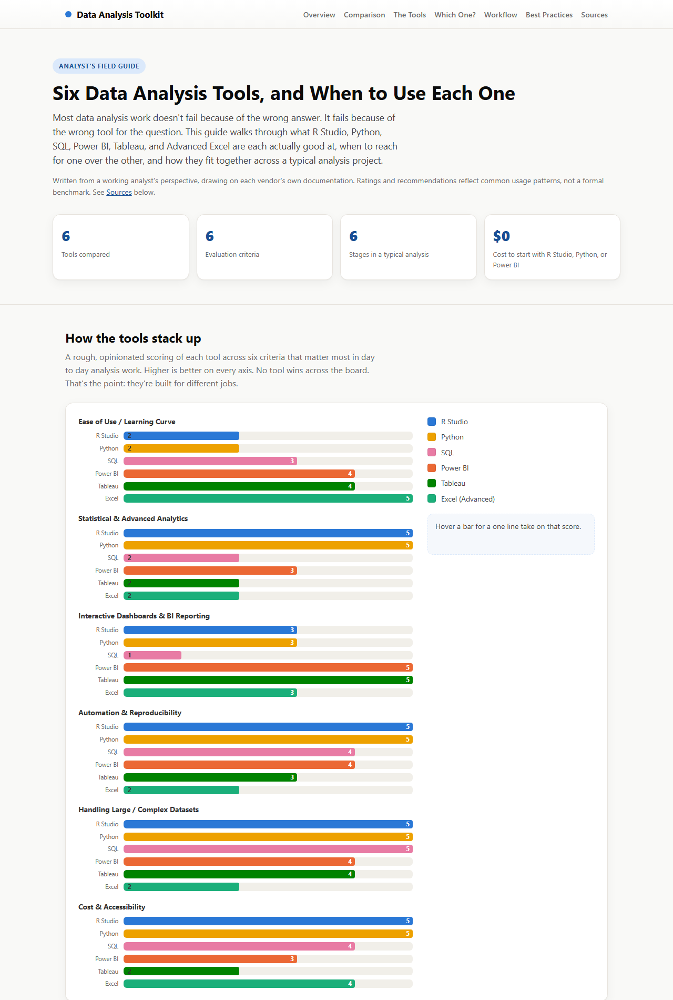
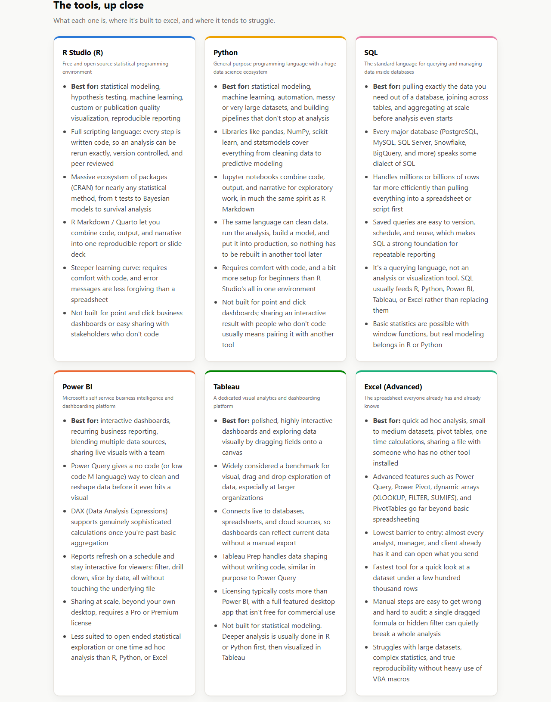
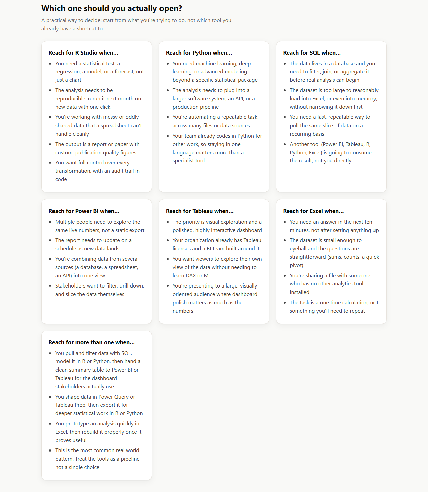
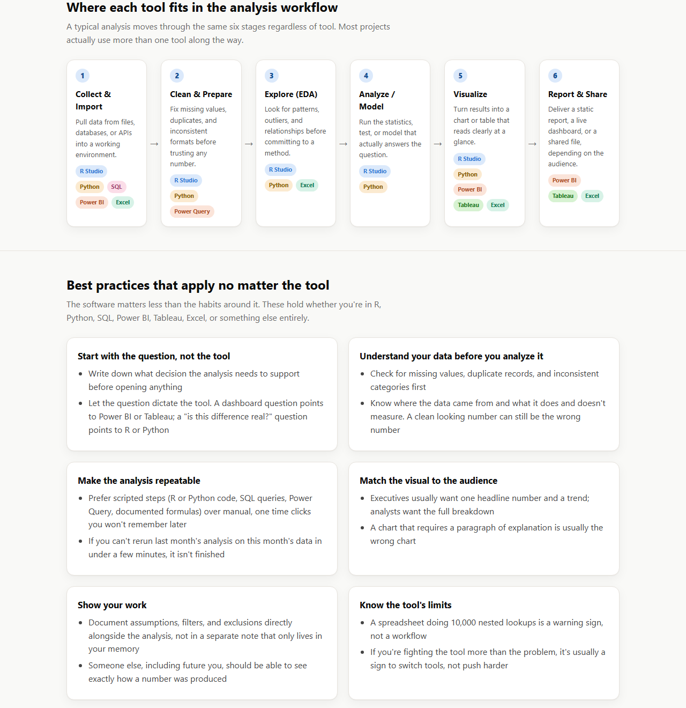

# Data Analysis Toolkit: R Studio, Python, SQL, Power BI, Tableau, and Excel

A single page guide comparing six data analysis tools analysts run into day to day: **R Studio**, **Python**, **SQL**, **Power BI**, **Tableau**, and **Advanced Excel**. It covers what each is good at, when to reach for which one, and how they fit together across a typical data analysis project.

**Live site:** https://stasnim99.github.io/Data-Analysis-Toolkit/

## Contents

- `index.html`: the entire site. HTML, CSS, and JavaScript in one self contained file. Open it directly in a browser, no server or build step needed.
- `images/`: screenshots of the live page used in the Preview section above.
- `README.md`: this file.

## What the page covers

- **Overview**: headline stats framing the comparison (tools, criteria, workflow stages)
- **Comparison**: a scored, hoverable bar chart rating all six tools across six criteria: ease of use, statistical power, dashboarding, automation and reproducibility, handling large data, and cost and accessibility

- **The Tools**: a deep dive card on each tool: what it is, where it excels, where it struggles

- **Which One?**: a practical decision guide ("reach for R Studio when...", "reach for Python when...", and so on), including the common real world pattern of using more than one tool in the same project

- **Workflow**: the six stage data analysis lifecycle (collect, clean, explore, analyze, visualize, report), each stage tagged with the tool(s) that tend to fit
- **Best Practices**: tool agnostic habits (start from the question, validate the data, make analysis repeatable, match the visual to the audience, document assumptions, know the tool's limits)

- **Sources**: links to official documentation for R, RStudio/Posit, Python, pandas, PostgreSQL, Power BI, Power Query, Tableau, and Excel

## Where the content came from

This is a synthesis of each vendor's own documentation (see the Sources section on the page) plus common, widely recognized usage patterns for each tool. It is not the output of a formal benchmark study.

## A word of caution on the ratings

The 1 to 5 scores in the comparison chart are a working analyst's judgment calls meant to prompt the right conversation ("which tool fits this job?"), not a precise scorecard. Actual fit depends on your dataset size, your team's existing skills, and what licensing your organization already has. Treat disagreement with a specific score as a reasonable, expected reaction. The goal is a useful starting framework, not a verdict.

## How it was built

Plain HTML, CSS, and vanilla JavaScript, with no frameworks or external libraries. Everything renders from data arrays defined directly in a `<script>` tag at the bottom of `index.html` (see the `criteria` and `stages` arrays). This keeps the whole project a single file that works offline and needs no build process.

## About

A quick reference field guide for deciding between R Studio, Python, SQL, Power BI, Tableau, and Excel (and for explaining that choice to someone else). 
